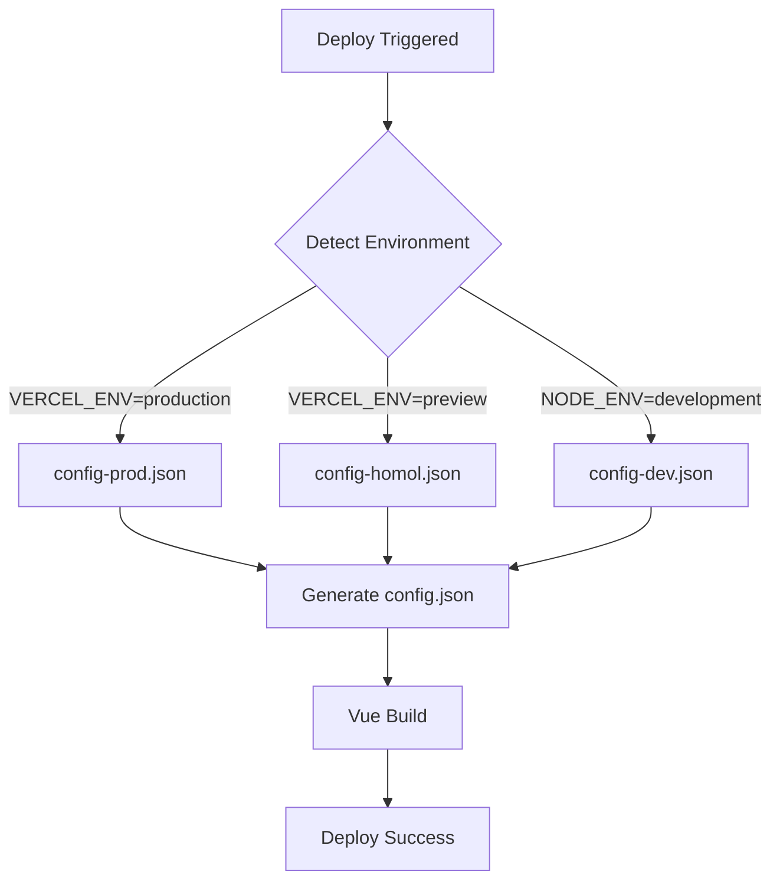

# Configuração de Ambientes - MyBP Front Vagas

## 🎯 **Sistema de Configuração por Ambiente**

O projeto agora suporta configuração automática baseada em ambiente, funcionando perfeitamente com **Vercel**, **Docker** e **desenvolvimento local**.

## 📁 **Estrutura de Configuração**

```
src/config/
├── config-dev.json      # Desenvolvimento (localhost)
├── config-homol.json    # Homologação (hdev.mybp.com.br)  
├── config-prod.json     # Produção (sistema.mybp.com.br)
└── config.json          # Gerado automaticamente ⚡
```

## 🚀 **Como Funciona**

### **1. Detecção Automática de Ambiente**
```javascript
// O script detecta automaticamente:
VERCEL_ENV=production     → config-prod.json
VERCEL_ENV=preview       → config-homol.json  
VERCEL_ENV=development   → config-dev.json
NODE_ENV=production      → config-prod.json
```

### **2. Geração Automática**
```bash
# Durante o build, o config.json é gerado automaticamente
npm run build  # Detecta ambiente e gera config
```

## 🛠️ **Comandos Disponíveis**

### **Scripts NPM**
```bash
# Desenvolvimento
npm run serve           # Auto-detecta ambiente  
npm run serve:dev       # Força desenvolvimento
npm run serve:homol     # Força homologação
npm run serve:prod      # Força produção

# Build
npm run build           # Auto-detecta ambiente
npm run build:dev       # Build desenvolvimento
npm run build:homol     # Build homologação  
npm run build:prod      # Build produção

# Configuração manual
npm run config:auto     # Auto-detecta
npm run config:dev      # Gera config-dev.json
npm run config:homol    # Gera config-homol.json
npm run config:prod     # Gera config-prod.json
```

### **Scripts Shell**
```bash
# Desenvolvimento local
./dev.sh               # Config + serve

# Build por ambiente
./build-homol.sh       # Build homologação
./build-prod.sh        # Build produção
```

## ☁️ **Configuração no Vercel**

### **1. Variáveis de Ambiente (Opcionais)**
No dashboard do Vercel, adicione se necessário:

```bash
# Para sobrescrever URL da API
VUE_APP_API_URL=https://api-custom.mybp.com.br/api/

# Para sobrescrever chave TinyMCE  
VUE_APP_TINYMCE_KEY=sua-chave-personalizada
```

### **2. Comportamento por Branch**
```bash
main/master     → VERCEL_ENV=production  → config-prod.json
outras branches → VERCEL_ENV=preview     → config-homol.json
vercel dev      → VERCEL_ENV=development → config-dev.json
```

### **3. Build Command (Automático)**
O Vercel usa automaticamente:
```bash
npm run build  # Já inclui npm run config:auto
```

## 🐋 **Configuração no Docker**

### **Build com Ambiente Específico**
```bash
# Desenvolvimento
docker build --build-arg NODE_ENV=development -t app:dev .

# Homologação  
docker build --build-arg NODE_ENV=homologation -t app:homol .

# Produção
docker build --build-arg NODE_ENV=production -t app:prod .
```

### **Atualizar Dockerfile**
```dockerfile
# Adicionar antes do npm run build
ARG NODE_ENV=production
ENV NODE_ENV=$NODE_ENV

# O build já executa npm run config:auto automaticamente
RUN npm run build
```

## 🔧 **Configurações Disponíveis**

### **config-dev.json** (Desenvolvimento)
```json
{
  "urlApi": "http://localhost:8000/api/",
  "dev": true,
  "tinyPadrao": { ... }
}
```

### **config-homol.json** (Homologação)
```json
{
  "urlApi": "https://hdev.mybp.com.br/api/",
  "dev": true,
  "tinyPadrao": { ... }
}
```

### **config-prod.json** (Produção)
```json
{
  "urlApi": "https://sistema.mybp.com.br/api/",
  "dev": false,
  "tinyPadrao": { ... }
}
```

## 🎨 **Personalização Avançada**

### **Override via Variáveis de Ambiente**
```bash
# Exemplo: API customizada em produção
export VUE_APP_API_URL=https://api-v2.mybp.com.br/api/
npm run build:prod

# Chave TinyMCE específica
export VUE_APP_TINYMCE_KEY=nova-chave-tinymce
npm run build
```

### **Adicionar Novo Ambiente**
1. Criar `config-novo.json`
2. Atualizar `scripts/generate-config.js`:
```javascript
case 'novo':
  configFile = 'config-novo.json';
  break;
```
3. Adicionar script no `package.json`:
```json
"build:novo": "NODE_ENV=novo npm run config:auto && vue-cli-service build"
```

## 🔍 **Debug e Troubleshooting**

### **Verificar Configuração Ativa**
```bash
# Ver qual config está sendo usado
node scripts/generate-config.js

# Verificar config.json gerado
cat src/config/config.json | jq
```

### **Problemas Comuns**

**Config não muda:**
```bash
# Limpar e regenerar
rm src/config/config.json
npm run config:prod
```

**API URL errada:**
```bash
# Verificar variáveis de ambiente
echo $NODE_ENV
echo $VERCEL_ENV
echo $VUE_APP_API_URL
```

**Build falha:**
```bash
# Verificar se arquivo de config existe
ls -la src/config/config-*.json
```

## 📊 **Fluxo Completo**



## ✅ **Checklist de Migração**

- [x] ✅ Scripts de geração automática criados
- [x] ✅ Package.json atualizado com novos comandos
- [x] ✅ Vercel.json configurado para auto-build
- [x] ✅ Scripts shell para cada ambiente
- [x] ✅ Sistema de override por variáveis de ambiente
- [x] ✅ Documentação completa

## 🎉 **Resultado**

Agora você tem:
- ✨ **Configuração automática** baseada no ambiente
- 🚀 **Deploy sem fricção** no Vercel
- 🔧 **Flexibilidade total** para customizações
- 📦 **Compatibilidade** com Docker e outros ambientes
- 🛡️ **Segurança** com variáveis de ambiente para dados sensíveis

**Uso simples:**
```bash
./deploy-vercel.sh      # Deploy com config automático! 🚀
```
